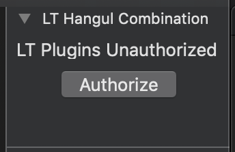

# LT-Hangul-Combination

This is a palette plugin for [Glyphs](https://glyphsapp.com)

## Requirements

You need to install and log in with [LT Toolkit Manager](https://github.com/hwoongkang/LT-Toolkit-Manager) in order to use this plugin.

Without toolkit manager, it will complain that you don't have access to it.

## Usage

Select and combinate [choseong(초성), jungseong(중성), and jongseong(종성)](https://en.wikipedia.org/wiki/Hangul_consonant_and_vowel_tables) to systematically choose Hangul glyphs.

### Select from

You can also specify from which Hangul specification you want to choose from.

By selecting 11172, you can choose any possible combination.

2350 and 2780 stands for [KS X 1001](<https://en.wikipedia.org/wiki/KS_X_1001#Pre-composed_Hangul_sets_(rows_number_16_through_40)>) and [Adobe KR9](https://github.com/adobe-type-tools/Adobe-KR/), respectively.

With the combination in the figure above, each options will result in selecting:

- 11172: 각갋감곡곫곰딱딻땀똑똛똠
- 2780: 각갋감곡곰딱땀똑똠
- 2450: 각감곡곰딱땀똑

### Select

This button is intended to be used in the font view, selecting glyphs in it.

### Open in a new tab

This button will open a new tab with the text formed with the combination.
